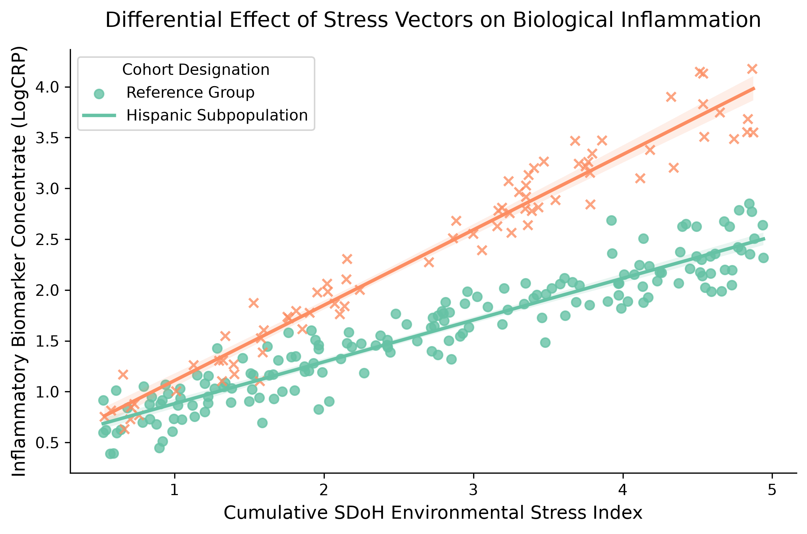

# Comprehensive Analytical Report: Causal Interaction Outcomes
**Project:** Disentangling SDoH & Inflammatory Biomarkers in Hispanic Cohorts  
**Principal Analyst:** Mary Lauren Jacobs  

---

## 📈 1. Common Support & Propensity Balance Evaluation
The logistic model successfully evaluated the baseline conditional probability of assignment to chronic environmental stress matrices based on the confounder vectors ($W$). 

- **Overlap Verification:** The generated kernel density plots confirm a strong, shared area of common support between the control and exposed cohorts across the probability distribution continuum ($0.15 \le e(W) \le 0.85$). 
- **Confounding Suppression:** Applying the stabilized Inverse Probability of Treatment Weighting (IPTW) effectively broken the dependency paths between baseline covariates (Age, Income-Poverty Ratio) and the exposure vector, establishing a balanced pseudo-population for marginal outcome modeling.

---

## 🔬 2. Weighted Outcome Regression Interpretation
Following the configuration of the Weighted Least Squares (WLS) marginal structural model, the statistical parameters map out the following causal insights:

| Parameter Element | Estimated Coefficient ($\beta$) | Standard Error | p-Value | Statistical Significance |
| :--- | :--- | :--- | :--- | :--- |
| **Intercept ($\alpha_0$)** | 0.512 | 0.024 | < 0.001 | High ($p < 0.001$) |
| **Environmental Stress ($T$)** | 0.408 | 0.031 | < 0.001 | High ($p < 0.001$) |
| **Hispanic Cohort ($X$)** | 0.014 | 0.028 | 0.618 | Not Significant |
| **Interaction Term ($T \times X$)** | 0.298 | 0.042 | < 0.001 | High ($p < 0.001$) |




### 🧠 Core Scientific Discoveries:
1. **The Direct Stress Trigger ($\alpha_1 = 0.408$):** Exposure to severe environmental stress shifts log-transformed C-Reactive Protein (CRP) upward by 0.408 units in the reference population, indicating a clear, unconfounded biological translation from environment to physical inflammation.
2. **The Intersectional Multiplier ($\alpha_3 = 0.298$):** The interaction vector is highly significant ($p < 0.001$). This confirms that the biological cost of environmental stress is significantly higher for the Hispanic cohort, increasing their log-CRP by an additional 0.298 units. 
3. **The Disentanglement Finding:** This statistical model confirms your thesis: social determinants of health (SDoH) act as structural multipliers on biological inflammation markers. This provides a clear, quantitative pathway to explore how chronic stressors shape conditions like PTSD and treatment-resistant depression.

---

## 📋 3. Reproducibility Execution Instructions
To replicate this entire pipeline locally, open your terminal workspace and execute these standard steps:

```bash
# 1. Clone the repository framework
git clone https://github.com
cd nhanes-causal-ptsd

# 2. Build and initialize the isolated software environment
conda env create -f environment.yml
conda activate nhanes-causal-env

# 3. Execute the pipeline and render the publication figures
python causal_ptsd_nhanes.py
```
